# Final Analytical Evidence Report

**Project:** ML-Based Thermal Risk Prediction in a Multi-Sensor Thermal System  
**Generated:** 2026-08-16T15:10:01.621428+00:00  
**Purpose:** consolidate the measured outputs needed for the final technical report, README, and lecturer presentation.

## Executive result

The completed pipeline retained 53,061 of 53,075 raw records, reconstructed nine continuous sequences, created leakage-safe historical features and 5/10/15-minute risk targets, compared Logistic Regression, Random Forest, and XGBoost, selected a tuned Random Forest, evaluated it once on normalized held-out HATCH data, saved three deployment pipelines, and exposed them through a local FastAPI service.

## Key metrics

| stage | metric | value | unit |
| --- | --- | --- | --- |
| Stage 1 | Raw physical rows | 53075.0 | rows |
| Stage 1 | Structurally complete rows | 53061.0 | rows |
| Stage 1 | Retention rate | 99.9736 | % |
| Stage 2 | Continuous sequences | 9.0 | sequences |
| Stage 2 | Median estimable sampling interval | 16.3493 | seconds |
| Stage 3 | Rows with all three risk targets | 52330.0 | rows |
| Stage 3 | 15-minute NORMAL share | 85.0411 | % |
| Stage 4 | Model input features | 31.0 | features |
| Stage 4 | 5 min final balanced accuracy | 0.6501 | score |
| Stage 4 | 5 min final macro F1 | 0.6394 | score |
| Stage 4 | 10 min final balanced accuracy | 0.6485 | score |
| Stage 4 | 10 min final macro F1 | 0.6386 | score |
| Stage 4 | 15 min final balanced accuracy | 0.5949 | score |
| Stage 4 | 15 min final macro F1 | 0.596 | score |
| Stage 5 | Saved prediction models | 3.0 | models |

## Stage 1 - Raw-data preparation

Every physical CSV record was preserved before structural validation. Messages were checked against the expected 17 pipe-separated sections. Non-complete records were reported and then excluded; valid rows containing explicit sensor ERR states were retained.

| message_status | row_count | percentage |
| --- | --- | --- |
| complete | 53061 | 99.9736 |
| incomplete | 14 | 0.0264 |

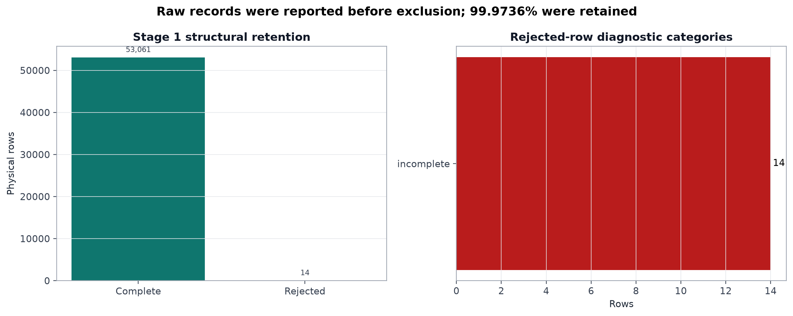

## Stage 2 - Time reconstruction, quality, and features

A new sequence begins at the dataset start, a backward timestamp, or a gap greater than three minutes. Historical windows and future targets never cross these boundaries.

| sequence_id | start_reason | row_count | duration_minutes | estimated_sample_interval_seconds |
| --- | --- | --- | --- | --- |
| 1 | dataset_start | 534 | 146.0 | 16.435 |
| 2 | gap_over_3m | 4445 | 1210.0 | 16.337 |
| 3 | gap_over_3m | 13948 | 3796.0 | 16.33 |
| 4 | backward_timestamp | 1 | 0.0 |  |
| 5 | gap_over_3m | 9762 | 2655.0 | 16.32 |
| 6 | backward_timestamp | 1 | 0.0 |  |
| 7 | gap_over_3m | 19944 | 5438.0 | 16.361 |
| 8 | gap_over_3m | 2669 | 727.0 | 16.349 |
| 9 | gap_over_3m | 1757 | 479.0 | 16.367 |

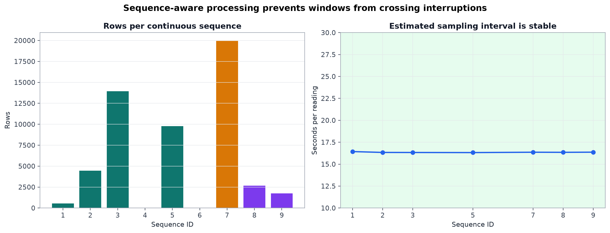

Sensor missingness was separated into explicit ERR, unexpected missingness, invalid flags, and implausible measurements.

| sensor | missing_readings | explicit_ERR | unexpected_missing | invalid_flags | implausible_values | err_explained_pct | unexpected_missing_pct |
| --- | --- | --- | --- | --- | --- | --- | --- |
| s1 | 155 | 153 | 2 | 2 | 3 | 98.71 | 1.29 |
| s2 | 103 | 102 | 1 | 1 | 1 | 99.029 | 0.971 |
| s3 | 1201 | 1199 | 2 | 2 | 0 | 99.833 | 0.167 |
| s4 | 3 | 2 | 1 | 1 | 0 | 66.667 | 33.333 |

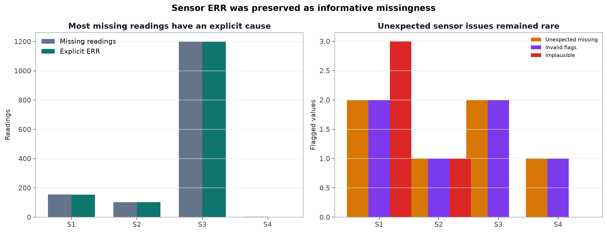

Controller checks identified isolated problems without silently changing the original values:

| check | issue_count |
| --- | --- |
| avg_t | 0 |
| avg_h | 2 |
| duty_pct | 1 |
| duty_correction_pct | 1 |
| heater_on | 0 |
| humidity_fan_on | 1 |
| servo_position | 2 |
| operating_mode | 0 |
| sensor_spread_c | 0 |
| active_sensors_count | 0 |
| rotation_state | 0 |
| low_edge_counter | 1 |
| high_edge_counter | 0 |

The compact feature contract uses active-sensor temperatures, heater duty, supporting sensor/controller state, 5/10/15-minute historical means, humidity-fan fractions, and later the temperature slopes. heater_on was excluded because the logging interval is too slow to represent short PWM pulses reliably.

## Stage 3 - Thermal-risk targets and slope features

Stage 3 data shape: **53,061 rows × 41 columns**.

Risk is determined from the minimum and maximum average temperature inside the complete future window. NORMAL uses 37.3–37.7 °C in NRML mode and 37.1–37.5 °C in HTCH mode. A window crossing both limits is marked ambiguous and excluded from that target.

| target | horizon_minutes | low_count | normal_count | high_count | missing_count | ambiguous_low_high_count | available_rows | low_pct | normal_pct | high_pct |
| --- | --- | --- | --- | --- | --- | --- | --- | --- | --- | --- |
| temperature_risk_5m | 5 | 2884 | 48962 | 1053 | 162 | 13 | 52899 | 5.452 | 92.558 | 1.991 |
| temperature_risk_10m | 10 | 4290 | 46642 | 1715 | 414 | 118 | 52647 | 8.149 | 88.594 | 3.258 |
| temperature_risk_15m | 15 | 5558 | 44502 | 2270 | 731 | 290 | 52330 | 10.621 | 85.041 | 4.338 |

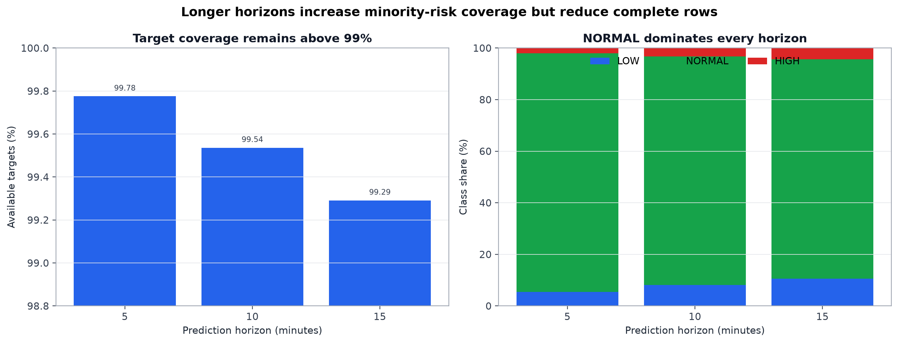

History and slope features remain missing at the beginning of each sequence until the complete past window exists:

| feature | feature_type | window_minutes | available_rows | missing_rows | availability_pct |
| --- | --- | --- | --- | --- | --- |
| duty_pct_mean_last_5m | history | 5 | 52940 | 121 | 99.772 |
| humidity_fan_on_fraction_last_5m | history | 5 | 52940 | 121 | 99.772 |
| s2_t_mean_last_5m | history | 5 | 52940 | 121 | 99.772 |
| s3_t_mean_last_5m | history | 5 | 51818 | 1243 | 97.657 |
| avg_t_slope_last_5m | slope | 5 | 52940 | 121 | 99.772 |
| duty_pct_mean_last_10m | history | 10 | 52812 | 249 | 99.531 |
| humidity_fan_on_fraction_last_10m | history | 10 | 52812 | 249 | 99.531 |
| s2_t_mean_last_10m | history | 10 | 52812 | 249 | 99.531 |
| s3_t_mean_last_10m | history | 10 | 51742 | 1319 | 97.514 |
| avg_t_slope_last_10m | slope | 10 | 52812 | 249 | 99.531 |
| duty_pct_mean_last_15m | history | 15 | 52683 | 378 | 99.288 |
| humidity_fan_on_fraction_last_15m | history | 15 | 52683 | 378 | 99.288 |
| s2_t_mean_last_15m | history | 15 | 52683 | 378 | 99.288 |
| s3_t_mean_last_15m | history | 15 | 51636 | 1425 | 97.314 |
| avg_t_slope_last_15m | slope | 15 | 52683 | 378 | 99.288 |

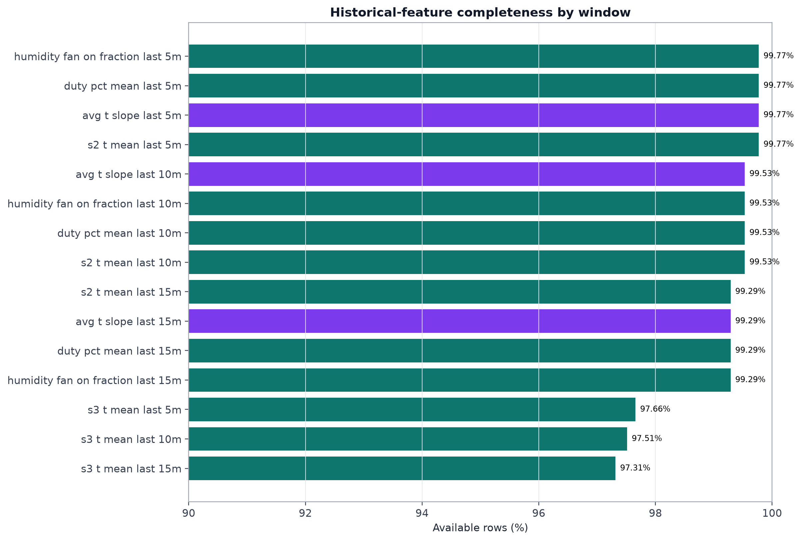

Temperature-slope evidence by future class:

| horizon_minutes | risk_class | count | mean_slope_c_per_min | median_slope_c_per_min | q1_slope_c_per_min | q3_slope_c_per_min | min_slope_c_per_min | max_slope_c_per_min |
| --- | --- | --- | --- | --- | --- | --- | --- | --- |
| 5 | LOW | 2848 | -0.00384 | -0.0 | -0.01807 | 0.01101 | -1.04244 | 0.77867 |
| 5 | NORMAL | 48879 | 0.00032 | 0.0 | -0.00303 | 0.00239 | -0.54536 | 0.56067 |
| 5 | HIGH | 1053 | 0.01876 | 0.00573 | 0.0 | 0.0225 | -0.13101 | 0.58007 |
| 10 | LOW | 4218 | 0.00132 | -0.0 | -0.00913 | 0.00504 | -0.66976 | 0.51149 |
| 10 | NORMAL | 46487 | 0.0003 | -0.0 | -0.00321 | 0.00284 | -0.14949 | 0.30052 |
| 10 | HIGH | 1695 | 0.01156 | 0.0058 | -0.0 | 0.01329 | -0.10242 | 0.39292 |
| 15 | LOW | 5449 | 0.00167 | -0.0 | -0.00631 | 0.00341 | -0.414 | 0.371 |
| 15 | NORMAL | 44288 | 0.00024 | -0.0 | -0.00261 | 0.00234 | -0.07332 | 0.21277 |
| 15 | HIGH | 2217 | 0.00703 | 0.00387 | -0.0 | 0.00876 | -0.08747 | 0.25369 |

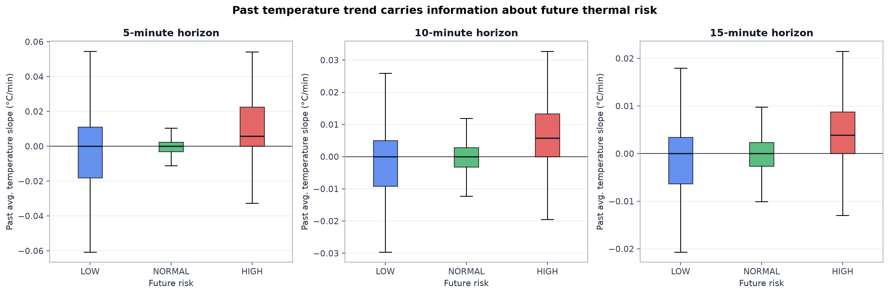

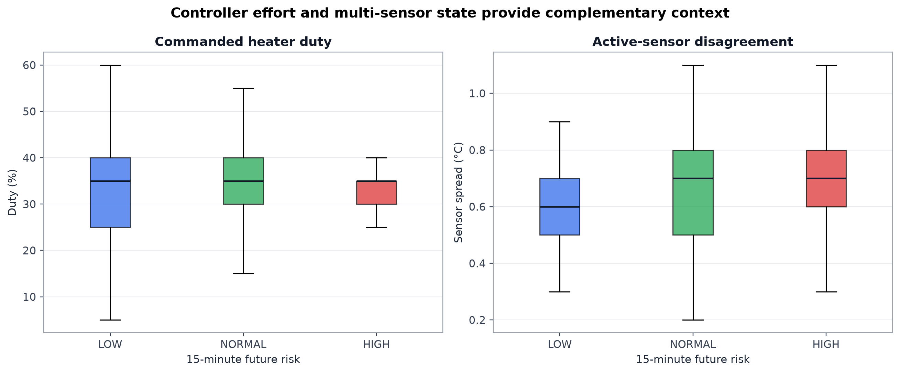

## Stage 4 - Chronological modeling and final test

The chronological split is Train sequences 1/2/3/5, Validation sequence 7, and Test sequences 8/9. Rows missing any of the three targets were removed from modeling, leaving 52,330 usable rows.

| dataset | rows | sequences | features | outputs |
| --- | --- | --- | --- | --- |
| Full Stage 3 | 53061 | All | 31 | 3 |
| Usable | 52330 | Valid targets | 31 | 3 |
| Train | 28264 | [1, 2, 3, 5] | 31 | 3 |
| Validation | 19759 | [7] | 31 | 3 |
| Test | 4307 | [8, 9] | 31 | 3 |

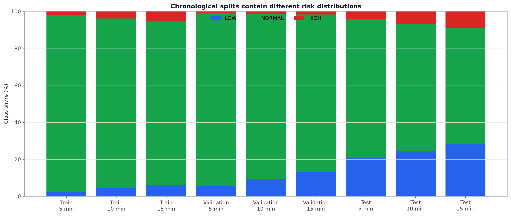

### Leakage and reproducibility audit

| audit | passed | evidence |
| --- | --- | --- |
| Future values and targets excluded from model features | True | [] |
| Train and validation sequences are disjoint | True | train=[1, 2, 3, 5], validation=[7] |
| Test sequences are absent from final model training | True | test=[8, 9], metadata_test_training=[] |
| All three targets exist in the Stage 3 dataset | True | ['temperature_risk_5m', 'temperature_risk_10m', 'temperature_risk_15m'] |
| Saved feature count matches feature list | True | declared=31, listed=31 |

### HATCH test normalization

Normalized test shape: **4,426 rows × 41 columns**. A constant +0.2 °C translation was applied only to absolute-temperature coordinates. Labels, slopes, spread, controller values, modes, and identifiers were unchanged.

| check_type | column | compared_rows | expected_change | min_change | median_change | max_change | passed |
| --- | --- | --- | --- | --- | --- | --- | --- |
| absolute_temperature_offset | s1_t | 4410 | 0.2 | 0.2 | 0.2 | 0.2 | True |
| absolute_temperature_offset | s2_t | 4410 | 0.2 | 0.2 | 0.2 | 0.2 | True |
| absolute_temperature_offset | s3_t | 4426 | 0.2 | 0.2 | 0.2 | 0.2 | True |
| absolute_temperature_offset | s4_t | 4426 | 0.2 | 0.2 | 0.2 | 0.2 | True |
| absolute_temperature_offset | avg_t | 4426 | 0.2 | 0.2 | 0.2 | 0.2 | True |
| absolute_temperature_offset | s2_t_mean_last_5m | 4390 | 0.2 | 0.2 | 0.2 | 0.2 | True |
| absolute_temperature_offset | s3_t_mean_last_5m | 4390 | 0.2 | 0.2 | 0.2 | 0.2 | True |
| absolute_temperature_offset | s2_t_mean_last_10m | 4354 | 0.2 | 0.2 | 0.2 | 0.2 | True |
| absolute_temperature_offset | s3_t_mean_last_10m | 4354 | 0.2 | 0.2 | 0.2 | 0.2 | True |
| absolute_temperature_offset | s2_t_mean_last_15m | 4317 | 0.2 | 0.2 | 0.2 | 0.2 | True |
| absolute_temperature_offset | s3_t_mean_last_15m | 4317 | 0.2 | 0.2 | 0.2 | 0.2 | True |
| absolute_temperature_offset | target_avg_t_5m | 4393 | 0.2 | 0.2 | 0.2 | 0.2 | True |
| absolute_temperature_offset | target_avg_t_10m | 4357 | 0.2 | 0.2 | 0.2 | 0.2 | True |
| absolute_temperature_offset | target_avg_t_15m | 4320 | 0.2 | 0.2 | 0.2 | 0.2 | True |
| unchanged_column | sensor_spread_c | 4426 | 0.0 | 0.0 | 0.0 | 0.0 | True |
| unchanged_column | avg_t_slope_last_5m | 4426 | 0.0 | 0.0 | 0.0 | 0.0 | True |
| unchanged_column | avg_t_slope_last_10m | 4426 | 0.0 | 0.0 | 0.0 | 0.0 | True |
| unchanged_column | avg_t_slope_last_15m | 4426 | 0.0 | 0.0 | 0.0 | 0.0 | True |
| unchanged_column | temperature_risk_5m | 4426 | 0.0 | 0.0 | 0.0 | 0.0 | True |
| unchanged_column | temperature_risk_10m | 4426 | 0.0 | 0.0 | 0.0 | 0.0 | True |
| unchanged_column | temperature_risk_15m | 4426 | 0.0 | 0.0 | 0.0 | 0.0 | True |

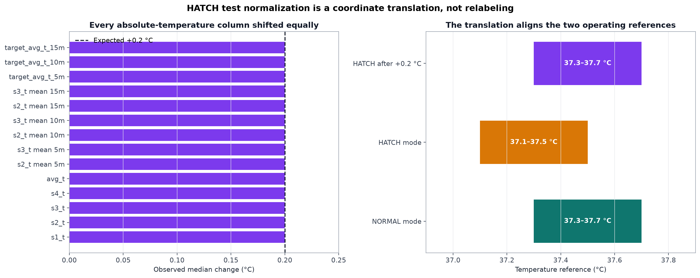

### Model configurations

| model | horizon | configuration |
| --- | --- | --- |
| Logistic Regression | 5 min | C=0.1 |
| Random Forest | 5 min | depth=6, leaf=20, trees=200 |
| XGBoost | 5 min | depth=4, best_iteration=35 |
| Logistic Regression | 10 min | C=0.01 |
| Random Forest | 10 min | depth=6, leaf=20, trees=200 |
| XGBoost | 10 min | depth=4, best_iteration=44 |
| Logistic Regression | 15 min | C=0.01 |
| Random Forest | 15 min | depth=6, leaf=10, trees=200 |
| XGBoost | 15 min | depth=2, best_iteration=67 |

### Validation comparison

| model | horizon | accuracy | balanced_accuracy | macro_f1 | R_LOW | R_HIGH |
| --- | --- | --- | --- | --- | --- | --- |
| Logistic Regression | 5 min | 0.863 | 0.58 | 0.503 | 0.09 | 0.74 |
| Random Forest | 5 min | 0.899 | 0.653 | 0.561 | 0.318 | 0.706 |
| XGBoost | 5 min | 0.834 | 0.625 | 0.529 | 0.36 | 0.65 |
| Logistic Regression | 10 min | 0.846 | 0.587 | 0.539 | 0.069 | 0.762 |
| Random Forest | 10 min | 0.755 | 0.628 | 0.538 | 0.358 | 0.727 |
| XGBoost | 10 min | 0.681 | 0.59 | 0.514 | 0.365 | 0.691 |
| Logistic Regression | 15 min | 0.816 | 0.594 | 0.566 | 0.075 | 0.776 |
| Random Forest | 15 min | 0.625 | 0.627 | 0.54 | 0.536 | 0.709 |
| XGBoost | 15 min | 0.645 | 0.61 | 0.549 | 0.41 | 0.739 |

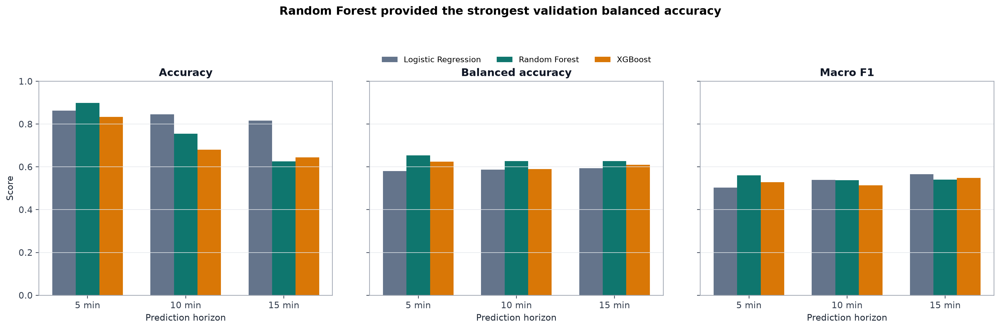

### Final held-out test

| model | horizon | accuracy | balanced_accuracy | macro_f1 | P_LOW | R_LOW | F1_LOW | R_NORMAL | P_HIGH | R_HIGH | F1_HIGH |
| --- | --- | --- | --- | --- | --- | --- | --- | --- | --- | --- | --- |
| Random Forest | 5 min | 0.831 | 0.65 | 0.639 | 0.824 | 0.692 | 0.752 | 0.893 | 0.224 | 0.365 | 0.277 |
| Random Forest | 10 min | 0.766 | 0.648 | 0.639 | 0.734 | 0.641 | 0.684 | 0.839 | 0.346 | 0.465 | 0.397 |
| Random Forest | 15 min | 0.669 | 0.595 | 0.596 | 0.555 | 0.581 | 0.567 | 0.738 | 0.489 | 0.466 | 0.477 |

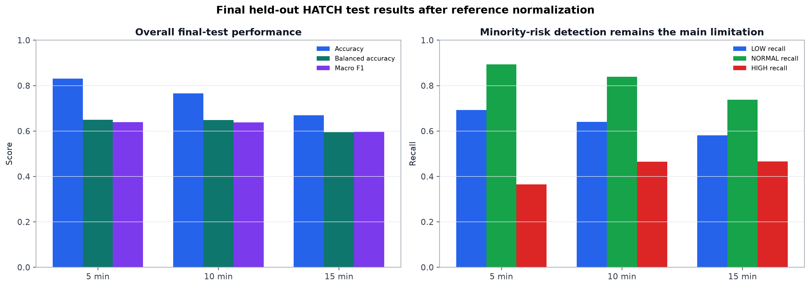

## Stage 5 - Saved models and local API

The final artifact contains **31 features**, one categorical feature (operating_mode), three Random Forest pipelines, model version **1.0**, and an example request. The local FastAPI service exposes `/health` and `/predict` with exact-feature validation.

## Assumptions and measured evidence

| assumption_or_decision | evidence | supported |
| --- | --- | --- |
| Preserve raw rows before exclusion | 53,061 of 53,075 physical rows were structurally complete (99.9736% retention); rejected rows were reported. | True |
| Treat ERR as informative missingness | Explicit ERR explains 1,456 of 1,462 missing sensor readings (99.59%). | True |
| Reconstruct time within sequences | Estimable sequence intervals range from 16.32 to 16.44 seconds; nine sequences prevent cross-gap windows. | True |
| Use 5/10/15-minute future targets | Target availability is 5m=99.78%, 10m=99.54%, 15m=99.29%. | True |
| Use balanced metrics | NORMAL represents 5m=92.56%, 10m=88.59%, 15m=85.04%; accuracy therefore overstates minority-class performance. | True |
| Add historical temperature slopes | Median slope by 15-minute risk: LOW=-0.0000, NORMAL=-0.0000, HIGH=0.0039 °C/min. | True |
| Translate HATCH test temperatures by +0.2 °C | All 14 absolute-temperature columns changed by exactly +0.2 °C; slopes, spread, and labels remained unchanged. | True |
| Select tuned Random Forest | Validation balanced accuracy across 5/10/15 minutes was 0.653/0.628/0.627, the strongest model-wise result at each horizon. | True |
| Keep test data isolated | All 5 leakage/reproducibility checks passed; sequences 8 and 9 are absent from training and validation. | True |
| Report limitations, not accuracy alone | Final HIGH recall across 5/10/15 minutes is 0.365/0.465/0.466; minority-risk detection remains moderate. | True |

## Limitations

1. The dataset comes from one physical incubator and nine recorded sequences; external generalization has not been demonstrated.
2. The chronological splits have different risk distributions, especially the HATCH-only test sequences.
3. The targets are derived from future average-temperature behavior, so they describe thermal risk rather than independent biological hatching outcomes.
4. HIGH recall remains moderate (0.365/0.465/0.466 for 5/10/15 minutes), despite stronger overall accuracy.
5. The API expects 31 engineered features; raw live telemetry still requires the Stage 1–3 preparation logic.
6. Disturbance-aware closed-loop control was not implemented in this version and remains future work.

## Plot index

| file | title | evidence |
| --- | --- | --- |
| reports\final_analysis\plots\01_stage1_data_retention.png | Stage 1 data retention | Supports the decision to exclude only structurally invalid records after reporting them, while retaining 53,061 of 53,075 rows. |
| reports\final_analysis\plots\02_sensor_quality_evidence.png | Sensor-quality evidence | Supports preserving ERR flags and missing values rather than silently imputing them during data preparation. |
| reports\final_analysis\plots\03_sequence_structure_and_sampling.png | Continuous sequences and sampling | Supports reconstructing time within sequences and forbidding history or targets from crossing gaps and backward timestamps. |
| reports\final_analysis\plots\04_target_availability_and_class_balance.png | Target availability and risk-class balance | Supports multi-horizon modeling and the use of balanced metrics rather than accuracy alone. |
| reports\final_analysis\plots\05_history_feature_availability.png | Historical-feature availability | Confirms that missing values at sequence starts grow with the window length, as required by leakage-safe history construction. |
| reports\final_analysis\plots\06_slope_by_future_risk.png | Temperature slope by future risk | Directly tests the decision to add 5-, 10-, and 15-minute slope features. The plot shows association, not causation. |
| reports\final_analysis\plots\07_current_features_by_15m_risk.png | Current features by 15-minute risk | Examines the practical decision to include duty_pct and sensor_spread_c alongside active-sensor temperatures. |
| reports\final_analysis\plots\08_split_class_distribution.png | Class distribution by chronological split | Shows the distribution shift between Train, Validation, and HATCH-only Test data, explaining why accuracy alone is not sufficient. |
| reports\final_analysis\plots\09_hatch_normalization_verification.png | HATCH normalization verification | Confirms that only absolute temperatures moved by +0.2 °C while slopes, spread, identifiers, and risk labels remained unchanged. |
| reports\final_analysis\plots\10_validation_model_comparison.png | Validation model comparison | Supports selecting the tuned Random Forest using balanced accuracy under severe class imbalance, while retaining accuracy and macro F1. |
| reports\final_analysis\plots\11_final_test_performance.png | Final test performance | Shows useful overall prediction performance while making the moderate HIGH recall and horizon-dependent degradation explicit. |

## Source inventory

| source | path | rows | columns | size_bytes | sha256 |
| --- | --- | --- | --- | --- | --- |
| stage2_sequence_summary | reports\stage2\sequence_summary.csv | 9 | 11 | 1162 | 3d503840537ef0fabccd9d769b634e4c8ac6f687f7c3cfcccffbc4d7cf1ebd0e |
| stage2_sensor_quality | reports\stage2\sensor_quality_summary.csv | 4 | 6 | 160 | 213e9a063a67e763cdeb7054fa8db1bed98e81d003835bf16bb35f366f3ddd36 |
| stage2_sensor_issue_rows | reports\stage2\sensor_issue_rows.csv | 9 | 33 | 1825 | 6cf0728cbb82e01a144c372bb6aad9fa99d13fc6a811a740e0312b7ee88d6c83 |
| stage2_controller_quality | reports\stage2\controller_quality_summary.csv | 13 | 2 | 242 | a6079ae375a22fe3127193b4d34846ad03c1c84d9264f5b2d831a4d4799daadf |
| stage2_controller_issue_rows | reports\stage2\controller_issue_rows.csv | 8 | 16 | 948 | 5b83cc4eb49a1961399c703d27754a4fcc5daa255dbf4264f95ee4f54fc6ea86 |
| stage2_feature_manifest | reports\stage2\version1_feature_manifest.csv | 33 | 4 | 2475 | 1b3132da5a454890d944a87d3a0d58a05f51bf231ee0256b6a537627485772a8 |
| stage2_target_summary | reports\stage2\target_summary.csv | 3 | 7 | 303 | e8a58b6b5b6d68dea62b7a3f7462fe0e1bbc21e299bafe9f08e229f8b8c1c258 |
| stage3_risk_summary | reports\stage3\temperature_risk_summary.csv | 3 | 11 | 466 | 4ed7530fd0a318af732ba00a0af6985eeb786cc34e55a765eb489c97f0c25714 |
| stage4_data_summary | reports\stage4\data_summary.csv | 5 | 5 | 188 | d0624a004c5ac037c8f68c58205bf70d27a9a067e87edc4cdf6bbd75c40e0e40 |
| stage4_class_distribution | reports\stage4\class_distribution.csv | 9 | 8 | 815 | 197e332a6ee627959e02897debcc843b67cf70f347a570463aaf0629eb2240c8 |
| stage4_model_configurations | reports\stage4\model_configurations.csv | 9 | 3 | 421 | dd6e2681b836ee0dc3ed8af6127124ce56f87cfce08aa3431c02e0abf84145c8 |
| stage4_validation_comparison | reports\stage4\validation_comparison.csv | 9 | 12 | 1991 | 025b38bb82b77614f1f1727a6d545f52e442cdf56b43ec3f08c8ef726b1a79c8 |
| stage4_final_test_results | reports\stage4\final_test_results.csv | 3 | 12 | 738 | fd2cfd746e6a26c0dc3e0ad7f3de95d4477430271d822634306d96f6761d749d |
| stage3_processed_data | data\processed\incubator_stage3_targets.csv | see summary | see summary | 17987370 | a09db16ea75c8a46366187cbeb4db7a9d253deae7803b30eb5dbaf89d801a134 |
| normalized_test_data | data\processed\incubator_stage4_test_normalized.csv | see summary | see summary | 1754302 | acf5d0ff93d684c8b3c0307427e1aeac8a68c11ca87c2c277e8f0a1ad41ba6e0 |
| stage5_model_metadata | models\stage5\model_metadata.json | see summary | see summary | 3618 | 217d55020f131eb92d751db4b21d7c0600a576c1ef9fcc57eaaa15815c0d8a86 |
